# 业务架构

## 1. MES 业务全景

MES（制造执行系统）是高驰手表产线的核心业务系统，覆盖从 SN 生成到售后激活的全链路。整体业务可归纳为 **3 条主线 + 3 个支撑**：

| 板块 | 类型 | 包含内容 | 核心数据表 |
|------|------|----------|------------|
| **生产执行** | 主线 | SN 生成→24 道工序→包装→出库 | `retroid`、`machine_data`、`procedure_detail` |
| **质量管理** | 主线 | FQC 入库检→OQC 出货检→不良品管理 | `inspection_records`、`defective_records` |
| **异常处理** | 主线 | 维修(F3)、补料(F4)、作废(F5)、返投 | `repair_flow_record`、`void_record`、`replenish_record` |
| **工单产品** | 支撑 | 工单创建/派工/关单、产品型号管理 | `joborder`、`product_info`、`product_model` |
| **设备资源** | 支撑 | 设备登录/在线状态/温湿度监控/远程执行 | `resource`、`resource_status`、`env_monitor` |
| **数据供给** | 支撑 | 定时抽取→daily_info→COROS 后台→报表 | `daily_info`、`production_detail`、`pack_detail` |

---

## 2. SN 全生命周期

SN（序列号）是 MES 的核心数据实体，贯穿产品从原材料到售后激活的完整生命周期：

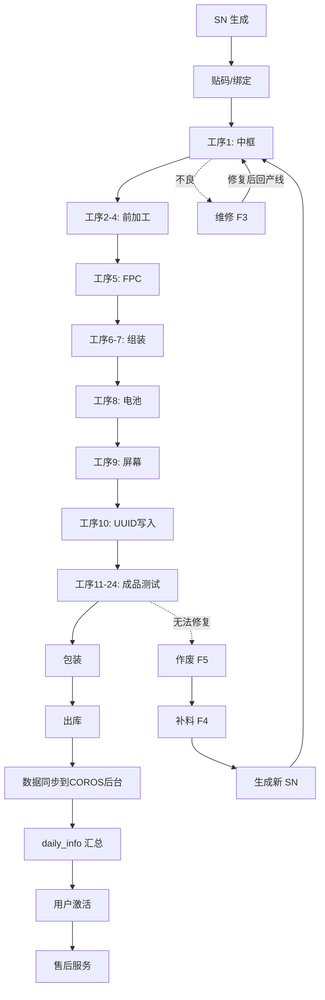

### 各阶段说明

| 阶段 | 做什么 | 涉及表 |
|------|--------|--------|
| **SN 生成** | 从工单获取 SN 段，调用 COROS 接口生成，写入数据库 | `retroid_generate`、`retroid` |
| **贴码/绑定** | 将 SN 与工单、产品型号、产线绑定，写入绑定关系 | `retroid`、`machine_data` |
| **24 道工序** | 每道工序扫码→校验→执行→写 machine_data | `machine_data`、`procedure_detail` |
| **包装** | 装箱、绑定箱码、生成包装记录 | `pack_detail`、`retroid` |
| **出库** | 仓库扫码出库，更新出库状态 | `mes_delivery_order_details`、`delivery_log` |
| **数据同步** | 定时任务将生产数据推送到 COROS 后台 | `daily_info` |
| **激活** | 用户首次开机激活，SN 与用户账号绑定 | `activation_records` |
| **售后** | 基于激活记录提供售后服务 | `activation_records` |

### 异常分支

- **不良→维修→回产线**：工序中出现不良，进入维修流程 F3，修复后回到原工序继续。
- **无法继续→作废→补料→新 SN**：无法修复或严重缺陷，执行 F5 作废当前 SN，执行 F4 补料生成新 SN，新 SN 重新进入生产流程。

---

## 3. SN 状态机

SN 在 MES 中有 **5 种状态**：

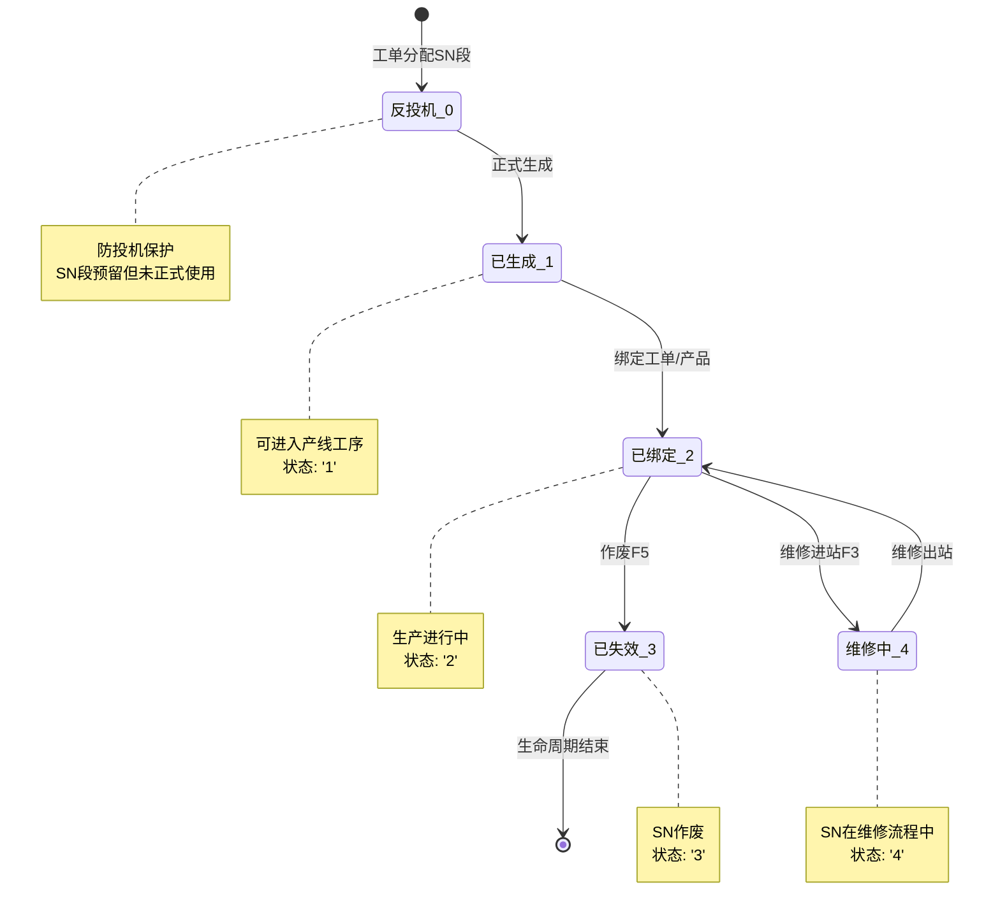

### 状态详表

| 状态值 | 含义 | 可否操作工序 | 进入条件 | 离开条件 |
|--------|------|-------------|----------|----------|
| `0` 反投机 | SN 段已分配但未正式生成 | ❌ 不可 | 工单分配 SN 段 | 调用生成接口 |
| `1` 已生成 | SN 已正式生成，等待绑定 | ✅ 可进入 | 从状态 0 正式生成 | 绑定工单后变为 2 |
| `2` 已绑定 | SN 已绑定工单，生产中 | ✅ 可进入 | 从状态 1 绑定 | 作废→3、维修→4、完工保持 2 |
| `3` 已失效 | SN 已作废 | ❌ 不可 | F5 作废流程 | 不可恢复 |
| `4` 维修中 | SN 进入维修流程 | ⚠️ 仅维修工序 | F3 维修进站 | F3 维修出站→恢复为 2 |

### SN 与组件绑定关系

| 工序 | 绑定内容 | 说明 |
|------|----------|------|
| 工序 1 | 中框 | 中框 SN 与主 SN 绑定 |
| 工序 5 | FPC | FPC 组件 SN 绑定 |
| 工序 8 | 电池 | 电池 SN 绑定（pd=31 或 62） |
| 工序 9 | 屏幕 | 屏幕 SN 绑定 |
| 工序 10 | UUID | UUID 写入，建立手表唯一标识 |

### 解绑机制

MES 的解绑不是物理 `DELETE`，而是**逻辑删除**：
- 在 `machine_data` 表中 `INSERT` 一条新记录，包含 `machine_data_id_old` 字段指向原记录
- 原记录保留，新记录标记为解绑操作
- 好处：完整追溯链，可审计

### 工序对 status 的校验

所有产线工序在执行前会校验 SN 状态：

```sql
WHERE status IN ('1', '2')
```

这个条件被 **40 个 n8n 工作流**使用，确保只有已生成或已绑定的 SN 才能过站。

---

## 4. 工单体系

### 工单生命周期

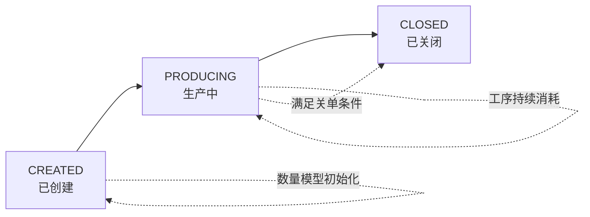

### 工单类型

| 类型 | 说明 | 使用场景 |
|------|------|----------|
| **组装** | 正常生产组装工单 | 手表主体组装 |
| **包装** | 包装工单 | 成品包装 |
| **维修** | 维修工单 | 不良品维修 |
| **售后** | 售后工单 | 售后处理 |
| **反投** | 反投机工单 | 异常 SN 重新投入 |

### 数量模型

| 字段 | 含义 | 说明 |
|------|------|------|
| `planQty` | 计划数量 | 工单初始计划产量 |
| `saleableGoodQty` | 可售良品数 | 合格可出库数量 |
| `sampleQty` | 样品数 | 留样数量 |
| `scrapQty` | 报废数 | 作废 SN 数量 |
| `repairingQty` | 维修中数量 | 当前在维修中的 SN 数 |
| `pendingReplenishQty` | 待补料数 | 等待补料的 SN 数 |

### 关单条件

工单关闭需要 **三个条件同时满足**：

1. `saleableGoodQty + sampleQty + scrapQty = planQty`（数量闭环）
2. `repairingQty = 0`（无维修中 SN）
3. `pendingReplenishQty = 0`（无待补料 SN）

### 数量闭环

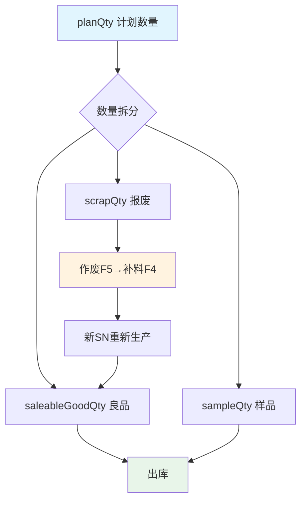

---

## 5. 工序体系

### W335 24 道工序

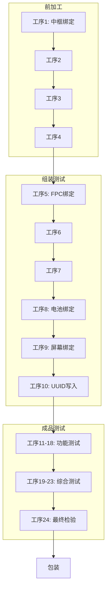

### 每道工序执行逻辑

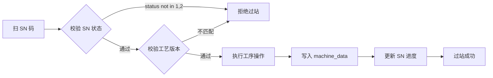

### 工艺管理

| 概念 | 说明 |
|------|------|
| **工序** | 单个生产步骤（如中框绑定、FPC 绑定） |
| **工艺流程** | 工序的顺序组合，定义产品的完整生产路径 |
| **工艺版本** | 工艺流程的版本号，支持工艺变更和追溯 |

工艺配置存储在 `procedure_detail` 表中，每个产品型号关联特定的工艺版本。

---

## 6. 质量管理

### FQC → OQC 流程

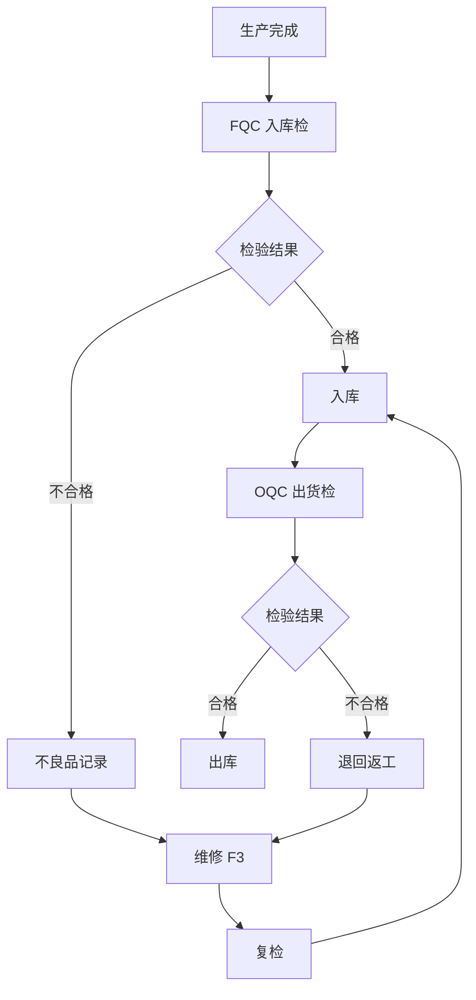

### 不良品管理

- 不良品记录存储在 `defective_records` 表（约 4.4 万条）
- 每条记录关联 SN、工序、不良原因、处理方式
- 不良品必须经过维修 F3 流程，修复后重新过站
- 无法修复的执行 F5 作废 + F4 补料

---

## 7. 异常处理

### 维修 F3 流程

核心规则：**只修不作废**。维修流程不产生新的 SN，仅修复当前 SN。

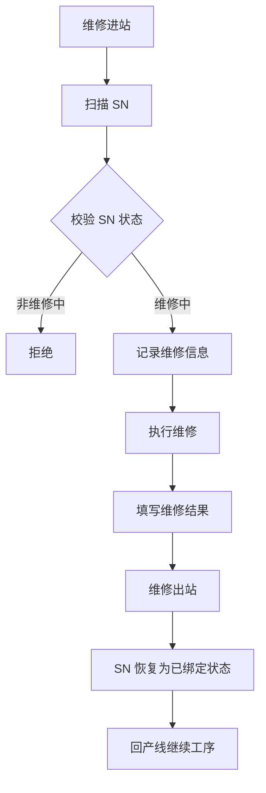

### 作废 F5 流程

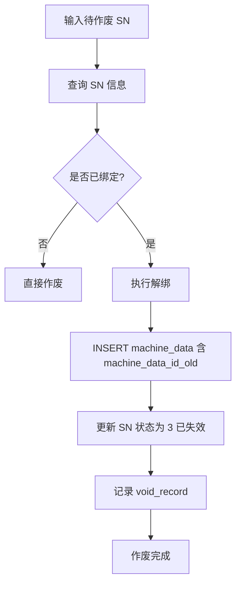

### 补料 F4 流程

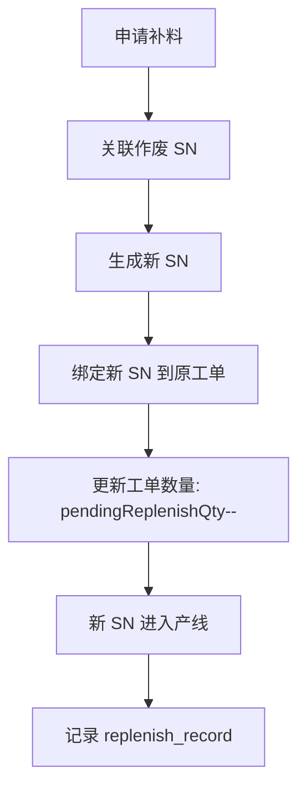

### 异常闭环

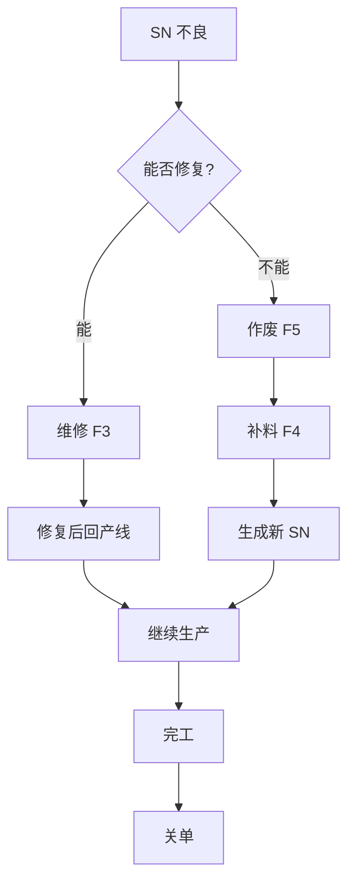

### 返投流程

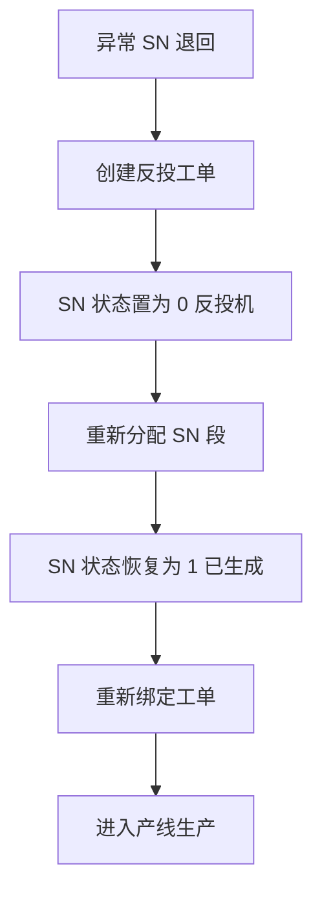

---

## 8. 包装与出库

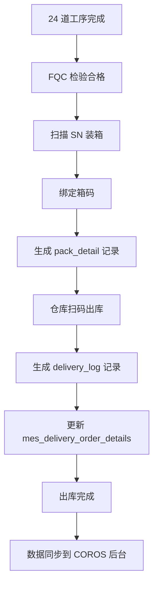

---

## 9. 设备与资源管理

| 功能 | 说明 | 涉及表/机制 |
|------|------|-------------|
| **设备登录** | 产线设备通过 Webhook 登录 MES，获取设备身份 | `resource` 表 |
| **在线状态** | 设备定期心跳上报，维护在线/离线状态 | `resource_status` 表 |
| **温湿度监控** | 环境监测设备定时上报温湿度数据 | `env_monitor` 表 |
| **远程执行** | 后台可远程向设备发送指令（如打印、参数配置） | MQTT / n8n 工作流 |
| **设备权限** | 不同设备有不同工序操作权限 | RBAC + 设备分组 |

---

## 10. 数据供给与报表

### 定时任务

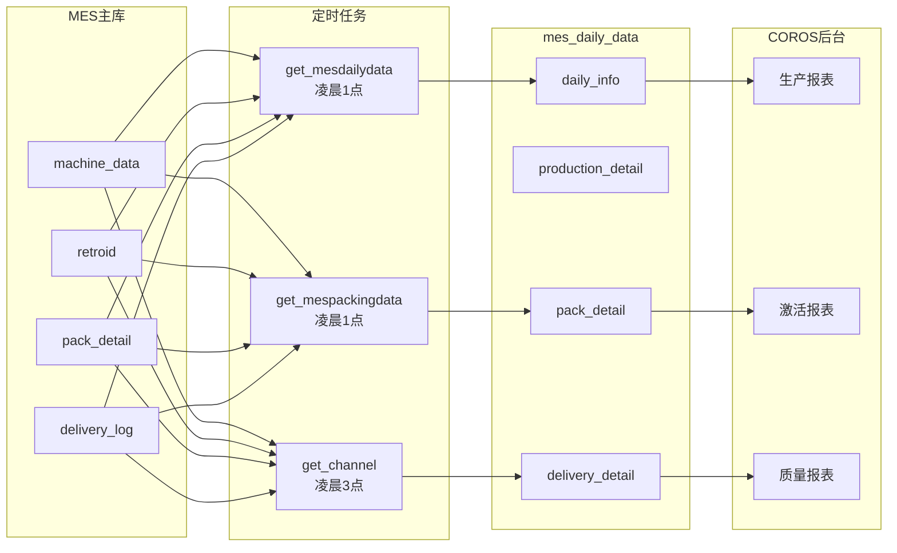

### 报表列表

| 报表名称 | 数据源 | 更新频率 |
|----------|--------|----------|
| 生产日报 | `production_detail` | 每日凌晨 1 点 |
| 包装日报 | `pack_detail` | 每日凌晨 1 点 |
| 出库日报 | `delivery_detail` | 每日凌晨 3 点 |
| 激活报表 | `activation_records` | 实时 |
| 质量报表 | `defective_records` | 实时 |
| 工单进度表 | `joborder` | 实时 |

---

## 11. 打印管理

| 模块 | 说明 |
|------|------|
| **模板管理** | 支持多种标签模板配置，按产品型号/工单类型选择 |
| **SN 标签打印** | 每道工序可打印 SN 标签，包含 SN、型号、日期等 |
| **箱标打印** | 包装环节打印箱标，包含箱码、SN 列表、数量等 |

打印通过 n8n 工作流调用打印服务，支持远程打印机和本地打印。

---

## 12. 模块联动关系图

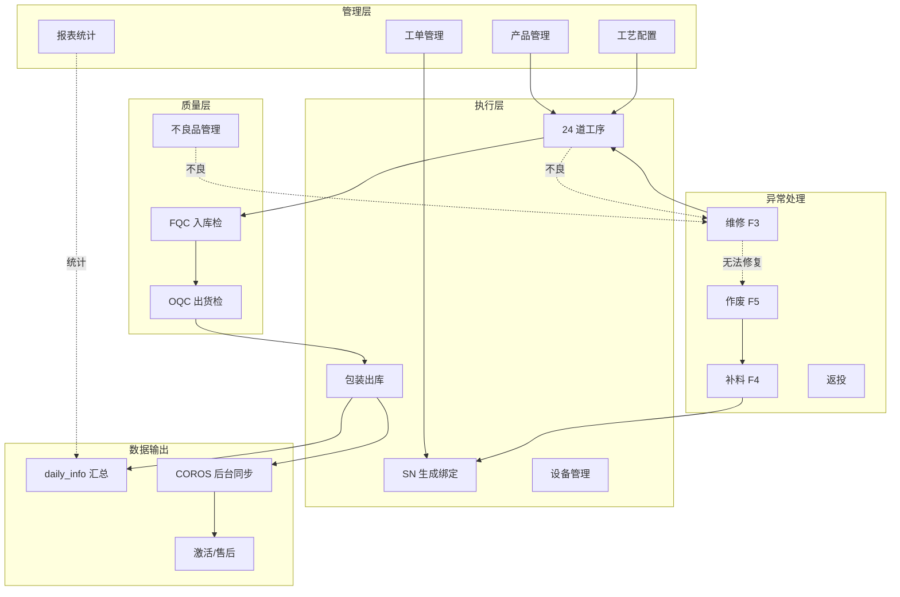

---

## 13. 术语表

| 术语 | 全称/含义 | 说明 |
|------|-----------|------|
| **SN** | Serial Number 序列号 | 手表唯一标识，贯穿全生命周期 |
| **UUID** | Universally Unique Identifier | 手表内部唯一硬件标识，工序 10 写入 |
| **FPC** | Flexible Printed Circuit 柔性印刷电路 | 手表内部柔性电路板组件 |
| **FQC** | Final Quality Control 最终质量控制 | 入库前的质量检验 |
| **OQC** | Outgoing Quality Control 出货质量控制 | 出库前的质量检验 |
| **工序** | Procedure | 单个生产步骤，如中框绑定、FPC 绑定 |
| **工艺** | Process | 工序的组合和顺序，定义完整生产路径 |
| **过站** | Station Pass | SN 通过某道工序的记录 |
| **绑定** | Binding | SN 与工单、产品型号、组件的关联 |
| **解绑** | Unbinding | 解除 SN 与组件的关联（逻辑删除） |
| **反投机** | Anti-Speculation | 防止 SN 段被提前占用的保护机制 |
| **machine_data** | 机器数据 | 记录每道工序的执行数据 |
| **daily_info** | 日汇总信息 | 定时任务汇总的生产、包装、出库数据 |
