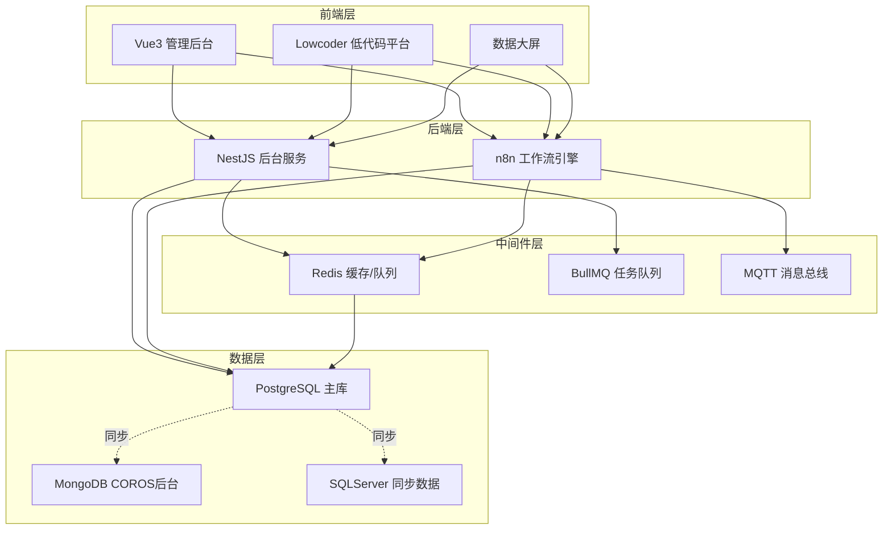
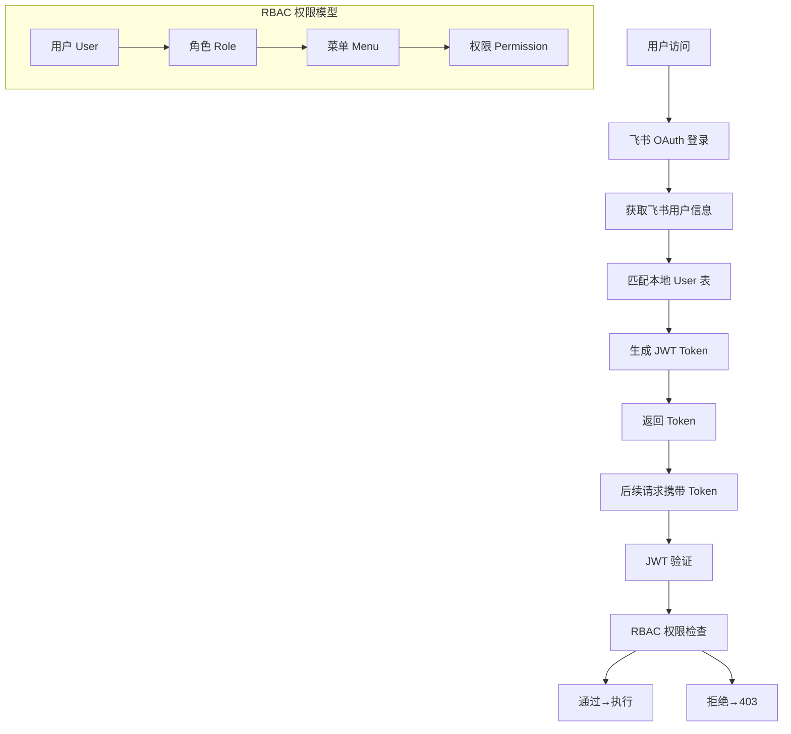
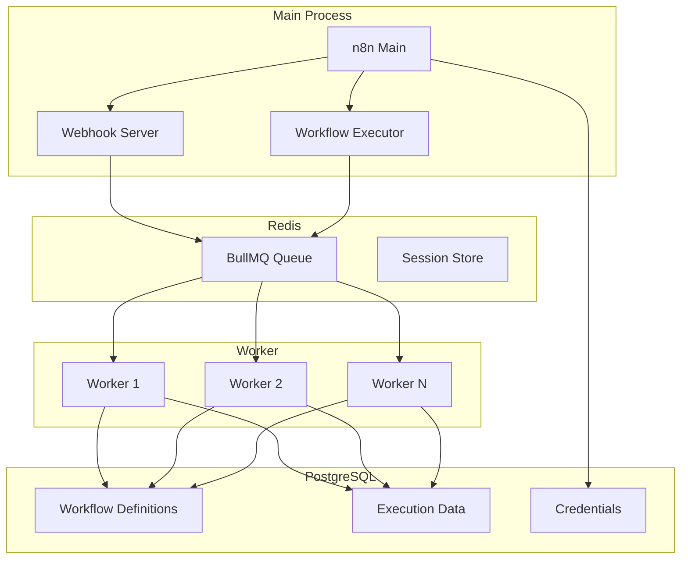
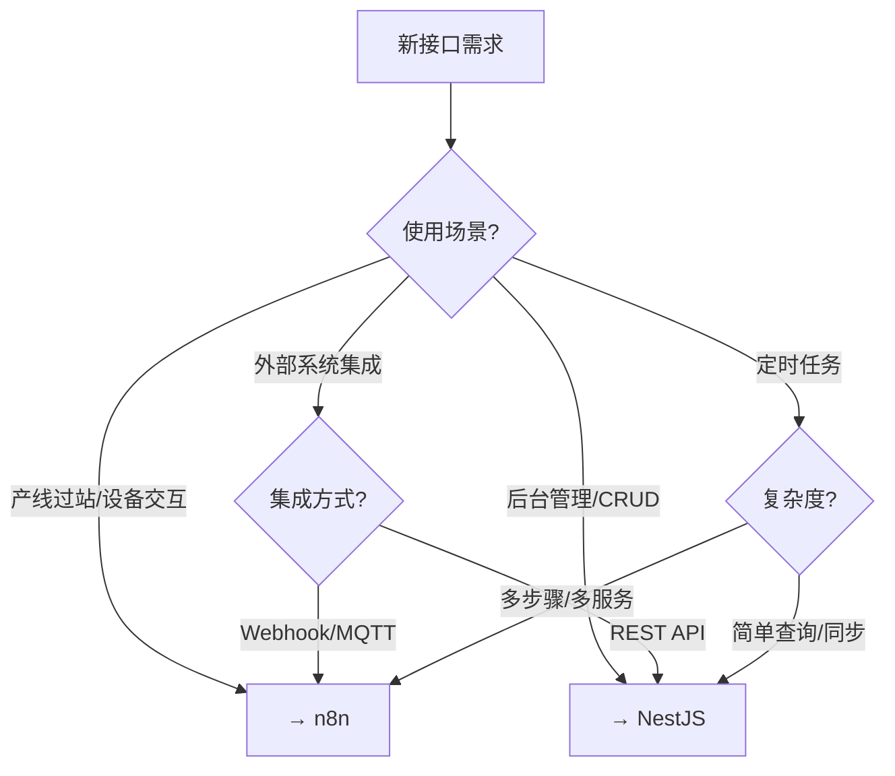
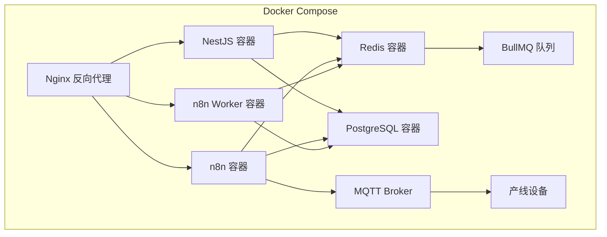

# 技术架构

## 1. 整体技术架构图



---

## 2. NestJS 后端

### 项目结构

```
src/
├── admin/                    # 后台管理模块
│   ├── product/              # 产品管理（型号、产品信息）
│   ├── operation/            # 工序管理
│   ├── config/               # 工艺配置
│   ├── ticket/               # 工单管理
│   ├── sn/                   # SN 管理
│   └── data-query/           # 数据查询
├── common/                   # 公共模块
│   ├── guards/               # 权限守卫
│   ├── interceptors/         # 拦截器（审计、日志）
│   ├── filters/              # 异常过滤器
│   └── utils/                # 工具函数
├── lark/                     # 飞书集成
│   ├── auth/                 # 飞书 OAuth 认证
│   └── notify/               # 飞书通知
└── system/                   # 系统管理
    ├── user/                 # 用户管理
    ├── role/                 # 角色管理
    ├── menu/                 # 菜单管理
    ├── dept/                 # 部门管理
    └── datalog/              # 操作日志（审计）
```

### 认证授权



**权限模型**：User → Role → Menu → Permission，基于飞书组织架构的 RBAC。

### 自动审计

通过 **Prisma Extension** 实现自动审计：

```
操作 (Create/Update/Delete)
  → Prisma Extension 拦截
    → 记录操作前/后的数据快照
      → 写入 DataLog 表
        → 包含: 操作人、时间、IP、表名、操作类型、变更前值、变更后值
```

### Prisma Schema（7 个文件）

| 文件 | 内容 | 说明 |
|------|------|------|
| `schema.prisma` | 主 Schema 文件 | 数据源配置、全局设置 |
| `admin.prisma` | 后台管理相关表 | 产品、工序、工艺、工单 |
| `system.prisma` | 系统管理相关表 | User、Role、Menu、Dept、DataLog |
| `lark.prisma` | 飞书相关表 | OAuth Token、用户映射 |
| `mes.prisma` | MES 核心表 | retroid、machine_data、procedure_detail |
| `daily.prisma` | 数据供给表 | daily_info、production_detail 等 |
| `warehouse.prisma` | 仓库相关表 | delivery_order、delivery_log 等 |

---

## 3. n8n 工作流引擎

### 定位

**n8n 是产线核心引擎，不是辅助工具。** 所有 24 道工序的过站逻辑、设备交互、数据写入都在 n8n 中实现。

### 技术参数

| 参数 | 值 |
|------|-----|
| 版本 | 1.113.2 |
| 工作流总数 | 322 |
| 活跃工作流 | 266 |
| 非活跃工作流 | 56 |
| 总节点数 | 约 6400 |
| 触发方式 | Webhook（产线）、Cron（定时）、Manual（手动）、Form（表单） |

### 内部架构



---

## 4. NestJS 与 n8n 分工

### 4 类接口标准



### 判断速查表

| 场景 | 选型 | 原因 |
|------|------|------|
| 产线扫码过站 | n8n | 设备直连 Webhook，可视化调试 |
| 后台 CRUD | NestJS | 权限控制、事务、审计 |
| 外部 API 对接 | NestJS | 统一出口、类型安全 |
| 简单定时同步 | NestJS | Cron + Prisma，代码可维护 |
| 复杂数据流转 | n8n | 多节点编排，可视化 |
| 打印任务 | n8n | 已有打印工作流，快速接入 |

### 为什么 NestJS 的不放 n8n？

| 原因 | 说明 |
|------|------|
| **权限控制** | NestJS 有完整的 RBAC，n8n 无细粒度权限 |
| **事务管理** | Prisma 事务保证数据一致性 |
| **审计追踪** | Prisma Extension 自动记录变更 |
| **复杂查询** | Prisma 类型安全查询优于 n8n 的 SQL 节点 |
| **版本控制** | 代码在 Git 中，n8n 工作流导出/导入管理不便 |
| **联调效率** | NestJS 有 Swagger 文档、单元测试、本地调试 |

### 为什么产线的不搬 NestJS？

| 原因 | 说明 |
|------|------|
| **历史延续** | n8n 产线工作流运行多年，稳定可靠 |
| **改工序方便** | 拖拽式编辑，工艺变更即时生效 |
| **调试直观** | 每次执行有完整可视化日志 |
| **隔离性** | 产线工作流与后台服务隔离，互不影响 |

---

## 5. 迁移状态

### 已迁移到 Prisma/NestJS

| 模块 | 接口数 | 状态 |
|------|--------|------|
| 产品管理 | 7 | ✅ 全部迁移 |
| 工序管理 | 6 | ✅ 全部迁移 |
| 工艺配置 | 5 | ✅ 全部迁移 |
| 工单管理 | 3 | ✅ 部分迁移 |
| SN 管理 | 1 | ✅ 已迁移 |
| 数据查询 | 6 | ✅ 部分迁移（含已迁移标记） |
| 系统管理 | 全部 | ✅ 全部迁移 |

### 仍在 n8n

| 模块 | 说明 |
|------|------|
| 产线过站（24 道工序） | 322 个工作流中的核心部分 |
| 设备交互 | 设备登录、在线状态、远程执行 |
| 打印任务 | SN 标签打印、箱标打印 |
| 数据同步 | get_mesdailydata、get_mespackingdata、get_channel |

### 永远留在 n8n

| 模块 | 原因 |
|------|------|
| 产线工序过站 | 设备直连 Webhook，改动频繁，可视化调试必需 |
| 打印工作流 | 与硬件紧密耦合，独立运行 |
| 复杂数据流转 | 多步骤编排，n8n 更适合 |

---

## 6. 部署架构

### 服务器

| 服务器 | 用途 | 部署内容 |
|--------|------|----------|
| MES 主服务器 | 生产环境 | NestJS、n8n、Redis、PostgreSQL |
| 备份服务器 | 数据备份 | PostgreSQL 只读副本 |
| 测试服务器 | 测试环境 | 独立 NestJS + n8n + 测试数据库 |

### Docker Compose 组件



### 数据库连接信息

| 数据库 | 类型 | 用途 |
|--------|------|------|
| `mes_main` | PostgreSQL | MES 主库（retroid、machine_data、joborder 等） |
| `mes_daily_data` | PostgreSQL | 数据供给库（daily_info、production_detail 等） |
| `mes_jp` | PostgreSQL | 日本工厂数据 |
| `YFConsumer` | PostgreSQL | 消费者数据（276 万条） |
| `oms-service` | MongoDB | 订单管理系统 |
| `sqlserver_sync` | SQLServer | SAP 同步数据 |
