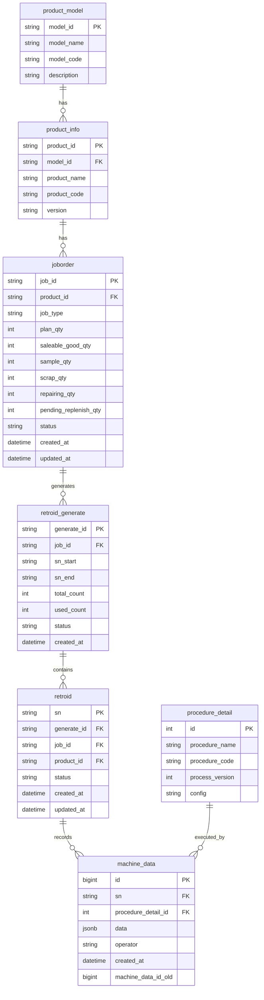
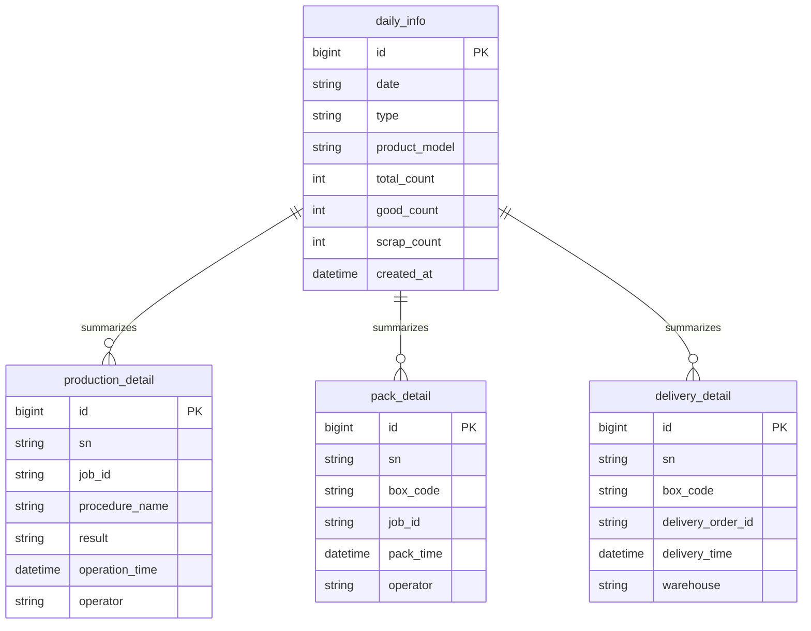
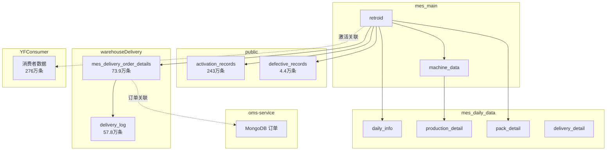

# 数据库参考手册

## 1. 全局 ER 图

### 生产核心 ER 图



### 数据供给 ER 图



### 跨库关联总图



### 最常用 JOIN 路径

```sql
-- 从 SN 追溯到产品型号
SELECT 
    r.sn,
    r.status,
    j.job_id,
    j.job_type,
    pi.product_name,
    pm.model_name,
    md.procedure_detail_id,
    pd.procedure_name,
    md.data,
    md.created_at
FROM retroid r
LEFT JOIN joborder j ON r.job_id = j.job_id
LEFT JOIN product_info pi ON j.product_id = pi.product_id
LEFT JOIN product_model pm ON pi.model_id = pm.model_id
LEFT JOIN machine_data md ON r.sn = md.sn
LEFT JOIN procedure_detail pd ON md.procedure_detail_id = pd.id
WHERE r.sn = 'SN20240101001';
```

---

## 2. 最常用查询路径

```sql
-- 完整追溯链：SN → 生成记录 → 工单 → 产品 → 型号
SELECT 
    r.sn,
    r.status AS sn_status,
    rg.sn_start,
    rg.sn_end,
    rg.total_count AS generate_total,
    j.job_id,
    j.job_type,
    j.status AS job_status,
    j.plan_qty,
    j.saleable_good_qty,
    j.scrap_qty,
    pi.product_name,
    pi.product_code,
    pi.version,
    pm.model_name,
    pm.model_code
FROM retroid r
INNER JOIN retroid_generate rg ON r.generate_id = rg.generate_id
INNER JOIN joborder j ON r.job_id = j.job_id
LEFT JOIN product_info pi ON j.product_id = pi.product_id
LEFT JOIN product_model pm ON pi.model_id = pm.model_id
WHERE r.sn = 'SN20240101001';
```

---

## 3. Schema 总览表

| Schema | 说明 | 主要表 |
|--------|------|--------|
| `mes` | MES 核心业务表 | retroid、machine_data、joborder、procedure_detail |
| `mes_daily_data` | 数据供给表 | daily_info、production_detail、pack_detail、delivery_detail |
| `public` | 公共表 | activation_records、defective_records、approval、suppliers |
| `warehouseDelivery` | 仓库出库表 | mes_delivery_order_details、delivery_log、delivery_order |
| `sync` | 同步数据表 | sap_job_info_cache、sn_material_code、yf_pcba_data |
| `system` | 系统管理表 | user、role、menu、dept、data_log |
| `mes_jp` | 日本工厂数据 | 日本产线相关表 |
| `lark` | 飞书集成表 | OAuth Token、用户映射 |

---

## 4. mes Schema 表字段详解

### retroid（SN 主表）

| 字段 | 类型 | 说明 |
|------|------|------|
| `sn` | VARCHAR | 主键，序列号 |
| `generate_id` | VARCHAR | 关联 retroid_generate |
| `job_id` | VARCHAR | 关联工单 |
| `product_id` | VARCHAR | 关联产品 |
| `status` | VARCHAR | 状态：0/1/2/3/4 |
| `created_at` | TIMESTAMP | 创建时间 |
| `updated_at` | TIMESTAMP | 更新时间 |

**status 使用模式**：

| 状态 | 含义 | 使用场景 |
|------|------|----------|
| `0` | 反投机 | SN 段预留，未正式使用 |
| `1` | 已生成 | 可进入产线 |
| `2` | 已绑定 | 生产中 |
| `3` | 已失效 | 已作废 |
| `4` | 维修中 | 在维修流程中 |

### machine_data（工序执行记录表）

| 字段 | 类型 | 说明 |
|------|------|------|
| `id` | BIGINT | 主键，自增 |
| `sn` | VARCHAR | 关联 SN |
| `procedure_detail_id` | INT | 关联工序 |
| `data` | JSONB | 工序执行数据 |
| `operator` | VARCHAR | 操作人 |
| `created_at` | TIMESTAMP | 创建时间 |
| `machine_data_id_old` | BIGINT | 解绑时指向原记录 ID |

**data 示例 JSON**：

```json
{
  "procedure_name": "中框绑定",
  "result": "PASS",
  "component_sn": "MID20240101001",
  "operator": "张三",
  "equipment_id": "EQ001",
  "temperature": 25.3,
  "humidity": 45.2
}
```

**关键 procedure_detail_id**：

| procedure_detail_id | 工序名称 | 说明 |
|---------------------|----------|------|
| 1 | 中框绑定 | 绑定中框组件 |
| 5 | FPC 绑定 | 绑定 FPC 组件 |
| 8 | 电池绑定 | 绑定电池（pd=31/62） |
| 9 | 屏幕绑定 | 绑定屏幕组件 |
| 10 | UUID 写入 | 写入 UUID |

### joborder（工单表）

| 字段 | 类型 | 说明 |
|------|------|------|
| `job_id` | VARCHAR | 主键，工单号 |
| `product_id` | VARCHAR | 关联产品 |
| `job_type` | VARCHAR | 工单类型 |
| `plan_qty` | INT | 计划数量 |
| `saleable_good_qty` | INT | 可售良品数 |
| `sample_qty` | INT | 样品数 |
| `scrap_qty` | INT | 报废数 |
| `repairing_qty` | INT | 维修中数量 |
| `pending_replenish_qty` | INT | 待补料数 |
| `status` | VARCHAR | 状态：CREATED/PRODUCING/CLOSED |
| `created_by` | VARCHAR | 创建人 |
| `created_at` | TIMESTAMP | 创建时间 |
| `updated_at` | TIMESTAMP | 更新时间 |
| `closed_at` | TIMESTAMP | 关闭时间 |
| `remark` | TEXT | 备注 |

### retroid_generate（SN 生成记录表）

| 字段 | 类型 | 说明 |
|------|------|------|
| `generate_id` | VARCHAR | 主键 |
| `job_id` | VARCHAR | 关联工单 |
| `sn_start` | VARCHAR | SN 段起始 |
| `sn_end` | VARCHAR | SN 段结束 |
| `total_count` | INT | 总数量 |
| `used_count` | INT | 已使用数量 |
| `status` | VARCHAR | 状态 |
| `created_by` | VARCHAR | 创建人 |
| `created_at` | TIMESTAMP | 创建时间 |
| `updated_at` | TIMESTAMP | 更新时间 |
| `remark` | TEXT | 备注 |

### 其他表简表

| 表名 | 说明 | 关键字段 |
|------|------|----------|
| `product_model` | 产品型号 | model_id, model_name, model_code |
| `product_info` | 产品信息 | product_id, model_id, product_name, version |
| `procedure_detail` | 工序详情 | id, procedure_name, procedure_code, process_version |
| `resource` | 设备资源 | resource_id, resource_name, resource_type |
| `resource_status` | 设备状态 | resource_id, online_status, last_heartbeat |

---

## 5. mes_daily_data Schema

### 表字段

| 表名 | 关键字段 | 说明 |
|------|----------|------|
| `daily_info` | id, date, type, product_model, total_count, good_count, scrap_count | 日汇总信息 |
| `production_detail` | id, sn, job_id, procedure_name, result, operation_time, operator | 生产明细 |
| `pack_detail` | id, sn, box_code, job_id, pack_time, operator | 包装明细 |
| `delivery_detail` | id, sn, box_code, delivery_order_id, delivery_time, warehouse | 出库明细 |

### 定时任务表

| 任务名 | 执行时间 | 功能 |
|--------|----------|------|
| `get_mesdailydata` | 凌晨 1:00 | 从 mes 主库抽取生产数据到 daily_info |
| `get_mespackingdata` | 凌晨 1:00 | 从 mes 主库抽取包装数据到 pack_detail |
| `get_channel` | 凌晨 3:00 | 从 mes 主库抽取渠道/出库数据到 delivery_detail |

---

## 6. NestJS 系统管理表

| 表名 | 说明 | 关键字段 |
|------|------|----------|
| `user` | 用户表 | user_id, username, open_id, dept_id, status |
| `role` | 角色表 | role_id, role_name, role_code, description |
| `menu` | 菜单表 | menu_id, menu_name, parent_id, path, permission |
| `dept` | 部门表 | dept_id, dept_name, parent_id, leader |
| `user_role` | 用户角色关联 | user_id, role_id |
| `role_menu` | 角色菜单关联 | role_id, menu_id |
| `data_log` | 操作日志表 | log_id, user_id, table_name, action, before_data, after_data, created_at |

---

## 7. public Schema

| 表名 | 数据量 | 说明 |
|------|--------|------|
| `activation_records` | 243 万条 | 用户激活记录，关联 SN 与用户 |
| `defective_records` | 4.4 万条 | 不良品记录，关联 SN 与不良原因 |
| `approval` | - | 审批记录 |
| `suppliers` | - | 供应商信息 |

---

## 8. warehouseDelivery Schema

| 表名 | 数据量 | 说明 |
|------|--------|------|
| `mes_delivery_order_details` | 73.9 万条 | 出库订单明细，每条记录一个 SN 的出库信息 |
| `delivery_log` | 57.8 万条 | 出库操作日志，记录每次扫码出库操作 |
| `delivery_order` | - | 出库订单主表 |
| `refund` | - | 退货记录 |
| `prototype_trial` | - | 样机试用记录 |

---

## 9. sync Schema

| 表名 | 说明 |
|------|------|
| `sap_job_info_cache` | SAP 工单信息缓存，从 SAP 系统同步 |
| `sn_material_code` | SN 与物料编码映射 |
| `yf_pcba_data` | PCBA 数据，从 YF 系统同步 |

---

## 10. 外部数据库

| 数据库 | 类型 | 说明 | 数据量 |
|--------|------|------|--------|
| `mes_jp` | PostgreSQL | 日本工厂 MES 数据 | - |
| `YFConsumer` | PostgreSQL | 消费者数据 | 276 万条 |
| `oms-service` | MongoDB | 订单管理系统 | - |

---

## 11. F3/F4/F5 新增表

| 表名 | 对应流程 | 关键字段 | 说明 |
|------|----------|----------|------|
| `repair_flow_record` | F3 维修 | id, sn, checkin_time, checkout_time, repair_result, operator | 维修流程记录 |
| `void_record` | F5 作废 | id, sn, void_reason, void_time, operator, machine_data_id_old | 作废记录 |
| `replenish_record` | F4 补料 | id, void_sn, new_sn, replenish_time, operator, job_id | 补料记录 |
