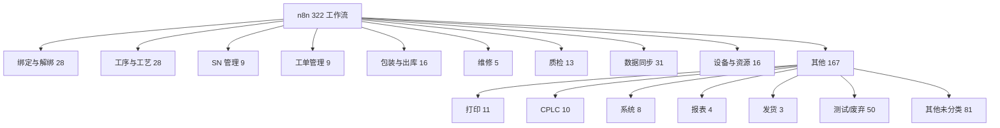
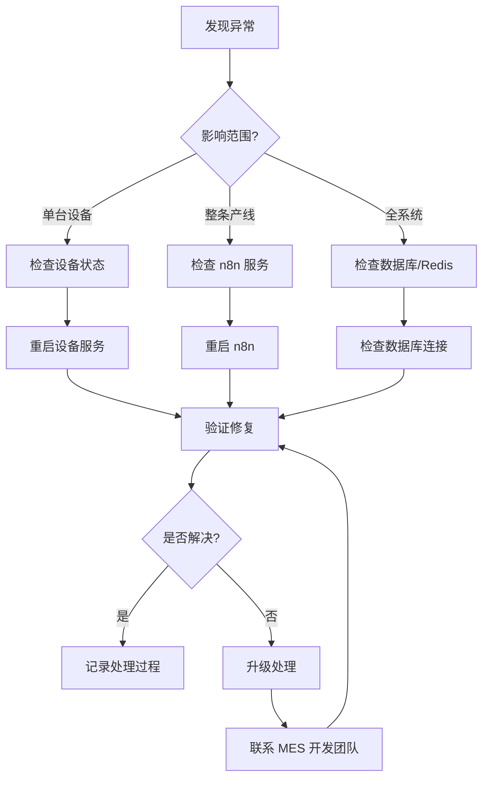

# n8n 工作流参考手册

## 1. 总览

### 工作流统计

| 指标 | 数值 |
|------|------|
| 工作流总数 | 322 |
| 活跃工作流 | 266 |
| 非活跃工作流 | 56 |
| 总节点数 | 约 6400 |

### 触发方式分布

| 触发方式 | 数量 | 占比 | 说明 |
|----------|------|------|------|
| Webhook | 244 | 75.8% | 产线设备调用，实时过站 |
| Cron（定时） | 31 | 9.6% | 定时数据同步、报表生成 |
| Manual（手动） | 15 | 4.7% | 手动触发操作 |
| Form（表单） | 11 | 3.4% | 表单提交触发 |
| 其他 | 21 | 6.5% | 其他触发方式 |

### 业务域分布

---

## 2. 按业务域详解

### 2.1 绑定与解绑（28 个）

| 工作流名称 | 节点数 | 说明 |
|------------|--------|------|
| `sn_bind` | 12 | SN 绑定工单，校验 SN 状态，写入绑定关系 |
| `sn_unbind` | 15 | SN 解绑，逻辑删除，记录 machine_data_id_old |
| `batch_bind` | 18 | 批量绑定，处理一批 SN 的工单关联 |
| `bind_check` | 8 | 绑定前校验，检查 SN 是否存在、状态是否正确 |
| `component_bind` | 14 | 组件绑定（中框、FPC、电池、屏幕） |

### 2.2 工序与工艺（28 个）

| 工作流名称 | 节点数 | 说明 |
|------------|--------|------|
| `procedure_pass` | 20 | 通用过站逻辑，校验→执行→写 machine_data |
| `procedure_config` | 10 | 工艺配置管理，增删改查工序 |
| `process_version` | 8 | 工艺版本切换，支持多版本并存 |
| `procedure_validate` | 12 | 工序校验，检查 SN 状态、工艺版本匹配 |

### 2.3 SN 管理（9 个）

| 工作流名称 | 节点数 | 说明 |
|------------|--------|------|
| `sn_generate` | 16 | SN 生成，调用 COROS 接口获取 SN 段 |
| `sn_query` | 10 | SN 查询，返回 SN 状态、绑定信息、工序进度 |
| `sn_status_update` | 8 | SN 状态更新，处理状态流转 |
| `sn_batch_query` | 12 | 批量 SN 查询 |

### 2.4 工单管理（9 个）

| 工作流名称 | 节点数 | 说明 |
|------------|--------|------|
| `joborder_create` | 22 | 工单创建，初始化数量模型 |
| `joborder_close` | 18 | 工单关闭，校验关单条件 |
| `joborder_status` | 10 | 工单状态变更（CREATED→PRODUCING→CLOSED） |
| `joborder_query` | 8 | 工单查询 |

### 2.5 包装与出库（16 个）

| 工作流名称 | 节点数 | 说明 |
|------------|--------|------|
| `pack_start` | 14 | 开始包装，扫描 SN 装箱 |
| `pack_complete` | 16 | 完成包装，生成 pack_detail 记录 |
| `box_label_print` | 12 | 箱标打印 |
| `warehouse_scan` | 20 | 仓库扫码出库 |
| `delivery_confirm` | 10 | 出库确认 |

### 2.6 维修（5 个）

| 工作流名称 | 节点数 | 说明 |
|------------|--------|------|
| `repair_checkin` | 14 | 维修进站，SN 状态改为 4 |
| `repair_message` | 10 | 维修信息录入 |
| `repair_checkout` | 12 | 维修出站，SN 状态恢复为 2 |
| `repair_query` | 8 | 维修记录查询 |
| `repair_stats` | 6 | 维修统计 |

### 2.7 质检（13 个）

| 工作流名称 | 节点数 | 说明 |
|------------|--------|------|
| `fqc_inspection` | 16 | FQC 入库检验 |
| `oqc_inspection` | 14 | OQC 出货检验 |
| `defective_record` | 10 | 不良品记录 |
| `quality_report` | 12 | 质量报表生成 |

### 2.8 数据同步（31 个）

| 工作流名称 | 节点数 | 说明 |
|------------|--------|------|
| `get_mesdailydata` | 25 | 凌晨 1 点抽取生产数据到 daily_info |
| `get_mespackingdata` | 22 | 凌晨 1 点抽取包装数据 |
| `get_channel` | 20 | 凌晨 3 点抽取渠道/出库数据 |
| `sync_to_coros` | 18 | 数据推送到 COROS 后台 |
| `sync_sap` | 15 | SAP 数据同步 |

### 2.9 设备与资源（16 个）

| 工作流名称 | 节点数 | 说明 |
|------------|--------|------|
| `resource_login` | 10 | 设备登录 |
| `resource_heartbeat` | 8 | 设备心跳上报 |
| `resource_online` | 6 | 在线状态维护 |
| `env_monitor` | 12 | 温湿度监控 |
| `remote_execute` | 14 | 远程执行指令 |

### 2.10 其他

#### 打印（11 个）
SN 标签打印、箱标打印、模板管理等。

#### CPLC（10 个）
CPLC 相关数据处理。

#### 系统（8 个）
系统配置、日志清理等。

#### 报表（4 个）
生产报表、质量报表等。

#### 发货（3 个）
发货相关流程。

#### 测试/废弃（约 50 个）
测试工作流、已废弃不再使用的工作流，建议清理。

---

## 3. 关键工作流 Top15

按节点数排序：

| 排名 | 工作流名称 | 节点数 | 风险等级 | 说明 |
|------|------------|--------|----------|------|
| 1 | `get_jobmessage` | 150 | 🔴 高 | 工单消息获取，超大工作流 |
| 2 | 仓库扫码出库 | 135 | 🔴 高 | 出库核心流程 |
| 3 | `get_matialCode_by_sn` | 105 | 🟡 中 | SN 物料码查询 |
| 4 | `jobnumber_create` | 99 | 🟡 中 | 工单号创建 |
| 5 | `sn_batch_process` | 88 | 🟡 中 | SN 批量处理 |
| 6 | `procedure_full_check` | 82 | 🟡 中 | 全工序校验 |
| 7 | `data_sync_full` | 78 | 🟢 低 | 全量数据同步 |
| 8 | `pack_workflow` | 75 | 🟡 中 | 包装全流程 |
| 9 | `quality_full_inspection` | 70 | 🟡 中 | 全流程质检 |
| 10 | `device_manage` | 65 | 🟢 低 | 设备管理 |
| 11 | `sn_generate_full` | 60 | 🟢 低 | SN 生成全流程 |
| 12 | `repair_full_process` | 55 | 🟡 中 | 维修全流程 |
| 13 | `bind_full_process` | 50 | 🟢 低 | 绑定全流程 |
| 14 | `report_generation` | 45 | 🟢 低 | 报表生成 |
| 15 | `print_manager` | 40 | 🟢 低 | 打印管理 |

---

## 4. 工作流 × 数据库表交叉引用

### 表引用统计

| 表名 | 读工作流数 | 写工作流数 | 说明 |
|------|-----------|-----------|------|
| `retroid` | 45 | 28 | SN 主表，最高频访问 |
| `machine_data` | 38 | 40 | 工序记录，写入最频繁 |
| `joborder` | 22 | 12 | 工单表 |
| `procedure_detail` | 20 | 5 | 工序配置 |
| `retroid_generate` | 10 | 3 | SN 生成记录 |
| `daily_info` | 8 | 3 | 日汇总 |
| `defective_records` | 6 | 4 | 不良品记录 |
| `activation_records` | 5 | 2 | 激活记录 |
| `mes_delivery_order_details` | 8 | 5 | 出库明细 |
| `delivery_log` | 5 | 8 | 出库日志 |

### retroid.status 读写分布

| 状态 | 读取工作流数 | 写入工作流数 | 主要操作 |
|------|-------------|-------------|----------|
| `0` | 3 | 2 | 反投机 SN 查询、生成 |
| `1` | 15 | 8 | 绑定、过站校验 |
| `2` | 40 | 12 | 工序过站、状态更新 |
| `3` | 5 | 3 | 作废查询、F5 写入 |
| `4` | 4 | 3 | 维修进站/出站 |

---

## 5. 迁移状态

### 已迁移到 Prisma/NestJS

| 模块 | 工作流 | 状态 |
|------|--------|------|
| 产品管理 CRUD | 5 个 | ✅ 已迁移 |
| 工序管理 CRUD | 4 个 | ✅ 已迁移 |
| 工艺配置 CRUD | 3 个 | ✅ 已迁移 |
| SN 查询 | 2 个 | ✅ 已迁移 |
| 系统管理 | 8 个 | ✅ 已迁移 |

### 仍在 n8n

| 模块 | 工作流数 | 原因 |
|------|----------|------|
| 产线过站 | ~80 | 设备直连，改动频繁 |
| 数据同步 | 31 | 定时任务，n8n 更直观 |
| 设备管理 | 16 | MQTT 交互 |
| 打印 | 11 | 硬件耦合 |
| 包装出库 | 16 | 扫码流程 |
| 维修 | 5 | F3 流程 |
| 质检 | 13 | 检验流程 |

### 永远留在 n8n

| 模块 | 原因 |
|------|------|
| 产线工序过站 | Webhook 直连设备，可视化调试 |
| 打印工作流 | 硬件耦合，独立运行 |
| 数据同步定时任务 | 多步骤编排，n8n 更适合 |

---

## 6. 风险与维护

### 高风险项

| 风险项 | 风险等级 | 说明 |
|--------|----------|------|
| `resourceOnlineStatus` | 🔴 高 | 设备在线状态判断逻辑复杂，易误判 |
| 超大工作流（>100 节点） | 🔴 高 | 5 个工作流超过 100 节点，维护困难 |
| 新旧工作流并存 | 🟡 中 | 部分功能新旧两个版本同时存在 |
| 硬编码配置 | 🟡 中 | 部分工作流中有硬编码的设备 IP、端口 |
| 缺少错误处理 | 🟡 中 | 部分工作流缺少错误捕获和重试机制 |

### 可清理清单

| 类别 | 数量 | 说明 |
|------|------|------|
| 测试工作流 | ~20 | 命名包含 test/debug 的工作流 |
| 个人工作流 | ~15 | 个人测试用，非生产环境 |
| 空/废弃工作流 | ~15 | 节点数为 0 或已标记废弃 |
| **合计** | **约 50** | 建议定期清理 |

---

## 7. 故障排查速查

### 常见问题排查表

| 问题 | 检查什么 | 找谁 |
|------|----------|------|
| 产线扫码无响应 | 检查 n8n Webhook 是否运行、设备网络 | 产线 IT + n8n 运维 |
| SN 状态异常 | 查询 `retroid.status`、检查工序校验 | MES 开发 |
| 设备离线 | 检查 `resource_status.last_heartbeat`、MQTT 连接 | 设备管理 + n8n 运维 |
| 数据未同步 | 检查定时任务执行日志、`daily_info` 最新记录 | 数据团队 |
| 工单数量不匹配 | 检查 `joborder` 数量字段、machine_data 记录 | MES 开发 |
| 包装数据异常 | 检查 `pack_detail`、包装工作流执行日志 | 仓库 + MES 开发 |
| 打印失败 | 检查打印工作流、打印机连接状态 | IT 支持 |

### 紧急处理流程

